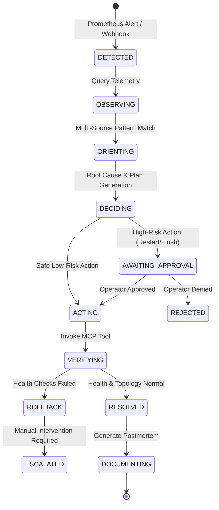

# Autonomous AI SRE Distributed Cache Platform

[](https://openjdk.org/)
[](https://spring.io/projects/spring-boot)
[](https://www.python.org/)
[](https://modelcontextprotocol.io/)
[](https://prometheus.io/)
[](https://react.dev/)

An enterprise-grade, distributed, self-healing cache platform augmented with an **Autonomous AI SRE Incident Response Layer** powered by the **Model Context Protocol (MCP)**.

---

## 1. System Architecture

The platform cleanly decouples **deterministic distributed systems self-healing** from **autonomous, reasoning-based AI incident response**:

```
                                  +-----------------------+
                                  |   Prometheus (9091)   |
                                  |  Alertmanager Rules   |
                                  +-----------+-----------+
                                              | Webhook Alerts
                                              v
+------------------------+      +---------------------------+
| React Incident Console |<---->|   Autonomous SRE Agent    |
| (Frontend Port 3000)   | HITL |      (Port 9090)          |
| - OODA Timeline        | Gate | - OODA Loop Engine        |
| - Interactive Approve  |      | - FastMCP / REST Client   |
+------------------------+      +-------------+-------------+
                                              | MCP Tool Invocations
                                              v
                                +---------------------------+
                                |  SRE Cluster MCP Server   |
                                |       (Port 8000)         |
                                | - Allowlisted Operations  |
                                | - Structured Log Filter   |
                                | - Docker / Metrics Bridge |
                                +-------------+-------------+
                                              |
                        +---------------------+---------------------+
                        |                     |                     |
                        v                     v                     v
              +-------------------+ +-------------------+ +-------------------+
              |   Cache Node 1    | |   Cache Node 2    | |   Cache Node 3    |
              |   (Port 8081)     | |   (Port 8082)     | |   (Port 8083)     |
              | - Murmur3 Hash    | | - Murmur3 Hash    | | - Murmur3 Hash    |
              | - Peer Heartbeats | | - Peer Heartbeats | | - Peer Heartbeats |
              | - Memory Eviction | | - Memory Eviction | | - Memory Eviction |
              +---------+---------+ +---------+---------+ +---------+---------+
                        ^                     ^                     ^
                        +---------------------+---------------------+
                                              |
                                     +--------+--------+
                                     | Gateway Service |
                                     |   (Port 8080)   |
                                     +-----------------+
```

### Key Architectural Layers

1. **Distributed Cache Cluster (`cache-service`)**:
   - 3-node cluster running Spring Boot 3.2 on Java 21.
   - Consistent hashing with virtual nodes using Murmur3 hash ring.
   - Deterministic peer-to-peer heartbeat monitoring and automated read/write failover.
   - Built-in chaos injection endpoints (`/api/v1/cache/chaos/*`) controlled via configuration flags.
   - Prometheus Micrometer metrics (`cache.node.last.heartbeat.seconds`, `jvm.memory.used`, etc.).

2. **SRE Cluster MCP Server (`sre-cluster-mcp`)**:
   - Implemented via FastMCP with dual JSON-RPC and REST HTTP bridge (`localhost:8000`).
   - Acts as the secure boundary between the AI Agent and the production infrastructure.
   - Strictly enforces allowlisted operations (no arbitrary shell or Docker execution).
   - Compresses multiline Java stack traces to eliminate token waste before sending context to LLMs.

3. **Autonomous AI SRE Agent (`sre-agent`)**:
   - Implements the real-time **OODA (Observe, Orient, Decide, Act, Verify, Document)** loop.
   - Listens to Prometheus alert webhooks or ad-hoc diagnostic triggers.
   - Generates structured incident context, root-cause hypotheses, and remediation plans.
   - Enforces Human-in-the-Loop (HITL) gates for disruptive actions (e.g. node restarts, cache flushes).
   - Executes post-remediation verification checks (Actuator health, cluster ring re-convergence).
   - Generates standardized postmortem markdown reports saved to `incidents/`.

4. **Incident Response Dashboard (`frontend`)**:
   - Real-time React 18 + TypeScript incident console.
   - Displays live incident state, OODA loop phases, confidence scores, and action plans.
   - Provides interactive **[ APPROVE ]** and **[ REJECT ]** controls for human operators.

---

## 2. The OODA Loop State Machine



- **Observe:** Gathers metrics, Actuator health, cluster topology, and compressed logs across nodes.
- **Orient:** Synthesizes patterns (e.g., `jvm_memory_pressure` vs. `partition_ring_imbalance`).
- **Decide:** Formulates exact root-cause hypothesis and selects allowlisted remediation action.
- **Act:** Validates HITL approval if disruptive, then invokes allowlisted MCP tool.
- **Verify:** Confirms 30-second sustained health recovery, Actuator `UP` status, and ring topology stability.
- **Document:** Writes structured incident postmortem markdown file to `incidents/INC-<id>.md`.

---

## 3. MCP Tool Catalog (`sre-cluster-mcp`)

All operations exposed to the AI SRE Agent are strictly typed and allowlisted:

| MCP Tool Name | Parameters | Allowed Target Scope | Description |
| :--- | :--- | :--- | :--- |
| `get_cluster_health` | `target_node` (optional) | `cache-node-1`, `cache-node-2`, `cache-node-3` | Returns Actuator status, memory pool usage, and uptime. |
| `get_node_metrics` | `node_id`, `metric_names` | Cluster nodes | Fetches Prometheus metrics (e.g. `cache.hit.ratio`, JVM memory). |
| `get_node_logs` | `node_id`, `lines`, `filter_level` | Cluster nodes | Retrieves container logs with token-efficient stack trace deduplication. |
| `get_cluster_topology` | *none* | Full Cluster | Inspects consistent hash ring status, node count, and replication factor. |
| `execute_remediation` | `action`, `target_node`, `params` | Allowlisted commands | Executes allowlisted remediation actions: `restart_node`, `flush_node_cache`, `rebalance_ring`, `isolate_node`. |
| `inject_chaos` | `scenario`, `target_node`, `duration_sec` | Chaos-enabled nodes | Triggers controlled chaos (`memory_pressure`, `latency_spike`, `partition_split`). |

### Security Boundaries
- **No Arbitrary Shell / Exec:** The LLM cannot run shell scripts, `docker exec` arbitrary strings, or execute arbitrary system binaries.
- **Strict Parameter Validation:** Node IDs and actions are validated against Pydantic enums and regex patterns.
- **HITL Enforcement:** Actions marked as `is_destructive: true` (e.g. `restart_node`, `flush_node_cache`) require explicit human operator confirmation.
- **Audit Logging:** Every MCP invocation is logged with timestamp, caller, parameters, and return status.

---

## 4. Quick Start & Setup

### Prerequisites
- **Java 21** (Temurin / OpenJDK)
- **Maven 3.8+** (or `./mvnw.cmd` included)
- **Python 3.10+**
- **Node.js 18+** & `npm`
- **Docker & Docker Compose** (optional for mock/dry-run, recommended for full deployment)

### 1. Environment Configuration
Copy the example environment configuration:
```powershell
Copy-Item .env.example .env
```
Key configuration settings in `.env`:
```ini
AI_SRE_LLM_PROVIDER=mock          # Options: "mock" (interview demo) or "gemini" / "openai"
AI_SRE_HITL_REQUIRED=true         # Enforce human approval for disruptive remediations
AI_SRE_MCP_SERVER_URL=http://localhost:8000
```

### 2. Running with Docker Compose
To launch the entire platform (Cache nodes, Gateway, Prometheus, MCP server, SRE Agent):
```bash
docker compose up -d --build
```

Service endpoints:
- **Cache Node 1:** `http://localhost:8081`
- **Cache Node 2:** `http://localhost:8082`
- **Cache Node 3:** `http://localhost:8083`
- **API Gateway:** `http://localhost:8080`
- **SRE Cluster MCP Server:** `http://localhost:8000` (docs at `http://localhost:8000/docs`)
- **SRE Agent Service:** `http://localhost:9090` (health at `http://localhost:9090/health`)
- **Prometheus UI:** `http://localhost:9091`

### 3. Running Locally with PowerShell
Use the provided orchestration script:
```powershell
# Run with Automated Chaos & SRE Demonstration
.\start-cluster.ps1 -Demo

# Run with interactive console prompt for human approval
.\start-cluster.ps1 -Demo -Interactive
```

---

## 5. Automated Chaos & SRE Incident Response Demo

The repository includes a self-contained demonstration script that simulates an end-to-end incident lifecycle in 15–60 seconds:

```bash
# Run the automated demo in dry-run mode (no external Docker daemon required):
python chaos/demo_runner.py --dry-run

# Run the automated demo against a live Docker cluster:
python chaos/demo_runner.py
```

### What Happens in the Demo:
1. **Phase 1: Baseline Check** — Queries cluster health across all 3 nodes and verifies consistent hash ring status.
2. **Phase 2: Chaos Injection** — Injects high memory pressure and eviction churn into `cache-node-2`.
3. **Phase 3: Alert Trigger** — Fires Prometheus `CacheNodeHighMemoryPressure` alert to SRE Agent webhook (`/api/sre/alerts`).
4. **Phase 4: Autonomous OODA Triage** — Agent enters `OBSERVE` and `ORIENT`, analyzing telemetry and compressed error logs via MCP.
5. **Phase 5: Decision & HITL Approval** — Agent isolates root cause, generates remediation plan (`restart_node` on `cache-node-2`), and requests operator approval.
6. **Phase 6: Allowlisted MCP Remediation** — Agent executes the restart remediation via `sre-cluster-mcp`.
7. **Phase 7: Verification** — Verifies Actuator health `UP`, verifies node rejoined hash ring, and confirms metrics normalization.
8. **Phase 8: Postmortem Inspection** — Displays generated incident postmortem report saved to `incidents/INC-<id>.md`.

---

## 6. Incident Postmortem Reports

Following every incident, the SRE Agent generates a structured, audit-ready postmortem:
- **Location:** `incidents/INC-<incident_id>.md`
- **Contents:**
  - Executive Summary & Severity Rating
  - Incident Timeline (T0 detection to resolution)
  - Telemetry snapshots (Prometheus metrics & compressed stack traces)
  - Root Cause Analysis (5-Whys methodology)
  - Preventative Actions & Follow-up Items

Example generated postmortem preview:
```markdown
# Incident Postmortem: INC-e0871146-5627
**Severity:** CRITICAL
**Status:** RESOLVED
**Impact:** Cache Node cache-node-2 degraded under memory churn.
...
### Timeline
- 10:45:00 UTC - Alert CacheNodeHighMemoryPressure fired.
- 10:45:02 UTC - OODA loop initiated; OBSERVE telemetry retrieved.
- 10:45:05 UTC - Root cause identified: JVM Old Gen exhaustion.
- 10:45:07 UTC - HITL Approval granted for restart_node.
- 10:45:10 UTC - MCP remediation invoked successfully.
- 10:45:15 UTC - Health verified: UP; ring re-converged.
```

---

## 7. Running Test Suites

Run all unit and integration tests across services:

```powershell
# 1. Run MCP and SRE Agent Python unit tests
pytest sre-cluster-mcp/tests sre-agent/tests -v

# 2. Run End-to-End Cache Cluster integration suite
python e2e_cluster_test.py --dry-run

# 3. Run Cache Service Java unit tests
cd cache-service
./mvnw.cmd test
cd ..
```

---

## 8. Technical Deep-Dive & Interview Talking Points

1. **Why Separate Self-Healing from AI SRE?**
   - *Deterministic self-healing* (gossip heartbeats, hash ring rebalancing, replica writes) must happen in sub-second timeframes without LLM latency or non-determinism.
   - *AI SRE triage* operates at the macro layer: multi-signal correlation (logs + metrics + topology), complex root-cause reasoning, and cross-system remediation decisions.

2. **Why Model Context Protocol (MCP)?**
   - Traditional AI agent setups give LLMs arbitrary bash/terminal access. In production, this is dangerous and prone to hallucinated `rm -rf` or destructive container commands.
   - MCP enforces a strictly typed, allowlisted capability boundary. The agent can only call predefined tools with validated schemas.

3. **Log Compression & Token Efficiency:**
   - Raw logs contain thousands of repetitive stack traces. The `LogCompressor` pipeline strips noise, deduplicates repeating traces, and extracts key exceptions, keeping prompt tokens low and inference fast.

4. **Human-in-the-Loop Safety:**
   - Safe diagnostic queries (telemetry, topology) execute autonomously. Destructive operations (`restart_node`, `flush_node_cache`) require explicit operator authorization via the React dashboard or CLI.
